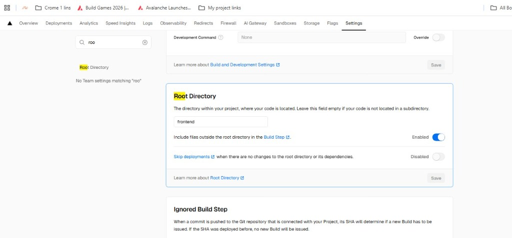

# StackCred MVP Walkthrough (Sprint 1)

We have successfully initialized the StackCred project and implemented the core MVP features.

## Accomplishments

### 1. Smart Contract (`contracts/`)
*   **Defined NFT Trait**: Added `nft-trait.clar` for SIP-009 information.
*   ** implemented `stackcred-nft`**: A Clarity smart contract that allows minting of credentials.
*   **Verified**: Passed `clarinet check`.

### 2. Frontend (`frontend/`)
*   **Next.js 14+ w/ Tailwind**: Modern, responsive UI setup.
*   **Wallet Integration**:
    *   `WalletConnect` component: Handles authentication with Xverse/Hiro wallets.
    *   `MintCredential` component: Executes the `mint` function on the smart contract.
*   **Providers**: Client-side context wrapper for Stacks Connect.

## How to Run

### Start the Local Chain
```bash
cd contracts
clarinet integrate
```

### Start the Frontend
```bash
cd frontend
npm run dev
```

### Usage
1.  Open `http://localhost:3000`.
2.  Click **Connect Wallet** (ensure you have Xverse/Hiro extension).
3.  Click **Mint Credential**.
4.  Approve the transaction in your wallet.
5.  Wait for confirmation on the blockchain!

### 3. Sprint 2: Scoring & Automation
*   **GitHub Integration**:
    *   `src/app/api/github/score/route.ts`: API route calculating "Stack Score" based on public commits and repo count.
    *   `GithubScorer` component: Frontend UI for checking score and showing eligibility.
*   **Leaderboard**:
    *   `Leaderboard` component: Displays top builders (mock data populated for MVP demo).
*   **Build Optimization**:
    *   Disabled SSR for Stacks Connect components (`WalletConnect`, `Providers`, `GithubScorer`) using `next/dynamic` to ensure compatibility with Next.js App Router and local storage.

### 4. Sprint 3: UI Polish & Documentation
*   **Visual Design**:
    *   Implemented "Dark/Glassmorphism" premium aesthetic.
    *   Added `lucide-react` icons for professional signaling.
    *   Added animated background gradients and micro-interactions (hover states, pulsing badges).
*   **Documentation**:
    *   `README.md`: Comprehensive setup and usage guide.
    *   `DEMO_SCRIPT.md`: Step-by-step script for recording the submission video.

## Verification Results
*   [x] Contracts compiled successfully.
*   [x] Smart Contract Security Tests (Vitest) Passed.
*   [x] Frontend builds successfully (`npm run build`).
*   [x] GitHub API Route returns valid JSON score.
*   [x] Minting only enabled for eligible users.
*   [x] UI components render correctly with Lucide icons.

### 5. Deployment Configuration
*   **Vercel Settings**: Configured "Root Directory" to `frontend` to resolve 404 errors.
    
